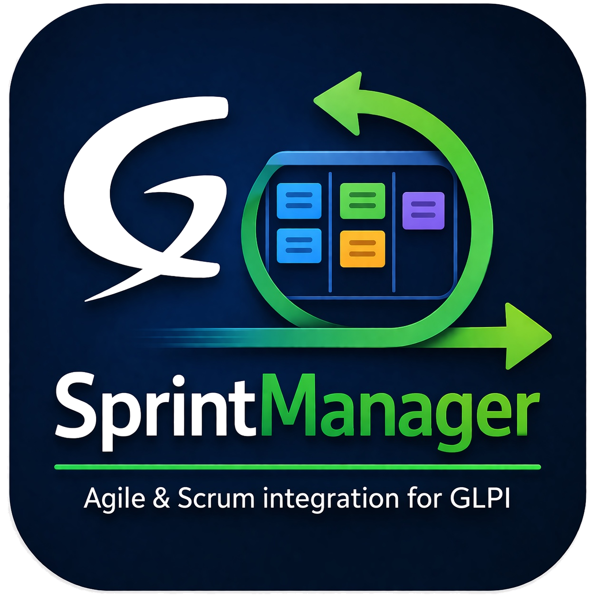

<p align="center">
  
</p>

<h1 align="center">SprintManager</h1>

<p align="center">
  <strong>Agile/Scrum sprint management, right inside GLPI.</strong><br>
  Link tickets, changes, and project tasks to sprints. Track capacity. Run standups.
</p>

<p align="center">
  
  
  
</p>

---

## What it does

SprintManager brings Agile/Scrum sprint management to GLPI. Create sprints, build backlogs by linking existing GLPI items, assign team members with capacity tracking, and run standups with interactive item reviews.

### Features

- **Sprint management** - Create sprints with configurable duration, goals, status, and sprint numbers
- **Sprint backlog (per sprint)** - Add manual items or link existing GLPI Tickets, Changes, and Project Tasks via searchable AJAX dropdowns
- **Global Backlog page** - Dedicated page for items waiting to be assigned to a sprint, with 1-click "Add to backlog" buttons on every Ticket / Change / Project Task, an inline "Assign to sprint" dropdown per row, and a filter bar (search by name, filter by type, sort)
- **Team members** - Assign members with roles (Scrum Master, Product Owner, Developer, Tester, Designer, DevOps, Analyst) and capacity percentages
- **Capacity tracking** - Set capacity per sprint item; dashboard shows per-member usage with visual overload detection
- **Dashboard** - Stats cards (total items, done, in progress, blocked, story points), progress bar, items overview, and team capacity visualization with Global and Personal view toggle
- **Meeting management** - Schedule kickoffs, standups, reviews, and retrospectives with a required facilitator
- **Interactive standup review** - During a meeting, review all sprint items inline: update status, reassign owners, and add notes — all saved with one click
- **Treated checkbox** - Mark items as discussed during standups; treated items are greyed out and locked
- **Persistent notes** - Notes per sprint item carry over between meetings for continuity
- **Smart linked-item display** - Linked Project Tasks show the parent project name in parentheses so tasks with identical names across projects can be told apart

#### Sprint Templates

- **Pre-defined team and backlog** - Define default members and backlog items to quickly bootstrap new sprints
- **Meeting schedule** - Configure recurring ceremonies with flexible scheduling:
  - **First day of sprint** - e.g., Sprint Kickoff (90 min)
  - **Recurring interval** - e.g., Standup every 2 days (15 min)
  - **Day before end / Last day** - e.g., Sprint Review (45 min), Retrospective (45 min)
- **Skip weekends** - Meetings on Saturday/Sunday automatically move to the next Monday
- **Optional ceremonies** - Mark meetings as optional (e.g., Retrospective)
- **Save as Template** - Convert any existing sprint (with members, items, and meetings) into a reusable template
- **Create from template** - Select a template when creating a new sprint; members, items, and meetings are auto-generated based on sprint dates

#### Role-Based Access Control (RBAC)

- **Sprint management** right - Create/edit/delete sprints, templates, members, and meetings
- **Sprint items** right - Manage backlog items with standard CRUD permissions
- **Own items only** right - Users can create items and edit/delete only items assigned to them
- Granular per-row permission checks in sprint item lists

#### GLPI Integration

- Full rights management with profile-based permissions
- Entity support and recursive rights
- History tracking on all entities
- Reverse tabs on Tickets, Changes, and Project Tasks

### Supported languages

| Language | Code |
|----------|------|
| English | `en_GB` |
| Nederlands | `nl_NL` |
| Fran&ccedil;ais | `fr_FR` |
| Espa&ntilde;ol | `es_ES` |

---

## Requirements

| Requirement | Version |
|-------------|---------|
| GLPI | 10.0+ / 11.0+ |
| PHP | 8.1+ |

---

## Installation

1. Download the latest release
2. Extract and rename the folder to `sprint`
3. Place it in your GLPI `plugins/` directory
4. Go to **Setup > Plugins** and click **Install**, then **Enable**
5. Go to **Administration > Profiles**, select a profile — sprint rights are automatically granted to Super-Admin

### Upgrading

Place the new files over the existing plugin folder and go to **Setup > Plugins** to run any database migrations.

---

## Usage

### Creating a sprint

1. Navigate to **Assistance > SprintManager**
2. Click **Add** to create a new sprint
3. Optionally select a **template** to pre-populate members, items, and meetings
4. Set the sprint name, duration, dates, goal, and scrum master (required)
5. If a template is selected, meetings are automatically generated based on sprint dates

### Setting up a template

1. Go to **Assistance > SprintManager > Templates**
2. Create a new template with name, duration, and goal
3. Add **Members** - define default team composition with roles and capacity
4. Add **Items** - define default backlog items with priority and story points
5. Add **Meetings** - configure the ceremony schedule:
   - Sprint Kickoff on first day (e.g., 90 min)
   - Standup every 2 days with skip weekends enabled (e.g., 15 min)
   - Sprint Review on day before end (e.g., 45 min)
   - Retrospective on last day, optional (e.g., 45 min)

Alternatively, open an existing sprint and click **Save as Template** to create a template from a sprint that's already configured.

### Managing the backlog of a sprint

1. Open a sprint and go to the **Sprint Items** tab
2. Select a type: **Manual item**, **Ticket**, **Change**, or **Project Task**
3. For Tickets/Changes: a searchable GLPI dropdown appears to select existing items
4. For Project Tasks: first select a Project, then pick a task from that project
5. Set owner, status, priority, story points, and capacity percentage

### Working with the global Backlog

The **Backlog** is a holding area for work that should land in *some* sprint, but hasn't been planned into one yet.

1. On any Ticket, Change, or Project Task, open the **Sprints** tab and click **Add to backlog** — the item is added to the global backlog with a single click. Duplicate adds for the same linked item are skipped automatically.
2. Open **Assistance > Backlog** to see everything in the queue.
3. Use the filter bar at the top to narrow the list:
   - **Search by name** — free-text match on the item name
   - **Type** — Ticket, Change, Project task, Manual, or All
   - **Sort** — Priority, Name, Newest first, Oldest first
   - The active filters live in the URL, so the page is shareable and bookmarkable
4. Per row, pick a Planned or Active sprint from the inline dropdown and click **Assign** — the item moves into that sprint and disappears from the backlog.

### Running a standup

1. Go to the **Meetings** tab and create a new meeting (facilitator is required)
2. Open the meeting — all sprint items appear in the **Sprint Items Review** table
3. Update status and owner per item using the inline dropdowns
4. Add notes (e.g., "Martijn will call the customer")
5. Check the **Treated** checkbox to mark items as discussed (row greys out)
6. Click **Save** — all changes are persisted in one action

### Monitoring capacity

The **Dashboard** tab shows:
- Stats cards for total items, done, in progress, blocked, and story points
- A progress bar with color-coded segments
- A **Team Capacity** table showing each member's available vs. used capacity with visual bars
- Toggle between **Global View** (all items, full team capacity) and **Personal View** (only your items, your capacity)

---

## Project structure

```
sprint/
├── setup.php                   # Plugin registration and hooks
├── hook.php                    # Database install/uninstall/migrations
├── sprint.xml                  # Plugin marketplace metadata
├── composer.json               # PSR-4 autoloading
├── src/
│   ├── Sprint.php              # Main sprint entity
│   ├── SprintItem.php          # Backlog items with GLPI item linking + RBAC
│   ├── Backlog.php             # Global backlog page (filter + assign-to-sprint)
│   ├── SprintMember.php        # Team members with roles and capacity
│   ├── SprintMeeting.php       # Meetings with inline item review
│   ├── SprintStandup.php       # Standup log entries
│   ├── SprintDashboard.php     # Dashboard with stats and capacity
│   ├── SprintTemplate.php      # Sprint templates (save as / create from)
│   ├── SprintTemplateMember.php  # Template default members
│   ├── SprintTemplateItem.php    # Template default items
│   ├── SprintTemplateMeeting.php # Template meeting schedule
│   ├── SprintTicket.php        # Sprint <-> Ticket relation (reverse tab)
│   ├── SprintChange.php        # Sprint <-> Change relation (reverse tab)
│   ├── SprintProjectTask.php   # Sprint <-> ProjectTask relation (reverse tab)
│   └── Profile.php             # RBAC rights management
├── front/                      # GLPI front controllers
├── ajax/                       # AJAX endpoints
├── templates/                  # Twig templates (GLPI 11)
├── css/sprint.css              # Plugin styles
├── js/sprint.js                # Client-side logic
├── locales/                    # Translation files (.po/.mo)
├── pics/                       # Plugin logo
├── CHANGELOG.md
├── LICENSE
└── README.md
```

---

## License

This project is licensed under the GNU General Public License v3.0 - see the [LICENSE](LICENSE) file for details.

Copyright &copy; 2026 DVBNL
