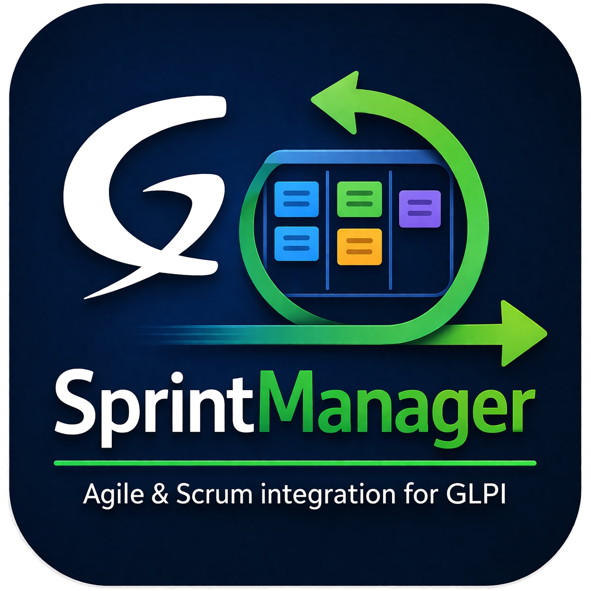

<p align="center">
  
</p>

<h1 align="center">SprintManager</h1>

<p align="center">
  <strong>Agile/Scrum sprint management, right inside GLPI.</strong><br>
  Link tickets, changes, and project tasks to sprints. Track capacity. Run standups.
</p>

<p align="center">
  
  
  
</p>

---

## What it does

SprintManager brings Agile/Scrum sprint management to GLPI. Create sprints, build backlogs by linking existing GLPI items, assign team members with capacity tracking, and run standups with interactive item reviews.

### Features

- **Sprint management** - Create sprints with configurable duration, goals, status, and sprint numbers
- **Sprint backlog (per sprint)** - Add manual items or link existing GLPI Tickets, Changes, **Problems**, and Project Tasks via searchable AJAX dropdowns
- **Global Backlog page** - Dedicated page for items waiting to be assigned to a sprint, with 1-click "Add to backlog" buttons on every Ticket / Change / Problem / Project Task, an inline "Assign to sprint" dropdown per row, and a filter bar (search by name, filter by type — including Problem, sort). Per-row **owner**, **estimated capacity** and **proposed sprint** dropdowns let the team fully pre-plan an item during kick-off; only the **Scrum Master of the chosen sprint** (or a full updater) can then press **Assign** to actually move it in. You can also add **cross-member dependencies straight from the backlog**, limited to people already in the pre-selected sprint. The sprint selector lists only planned/active sprints, naturally ordered (Sprint 9 before Sprint 10). Rows show a **Ready** badge once owner + capacity + sprint are set, the Scrum Master can **Assign all ready** in one click during kick-off, and items can be **dragged into a manual order** (persisted)
- **Sprint item tags** - Admin-defined tag pool (Settings → SprintManager → Sprint item tags). Members assign multiple tags from that pool to any sprint item via a checkbox group on the item form. Tags render as pills next to the item name everywhere (Sprint Items, Dashboards, Backlog, Meeting review) and a `.sf-tag` dropdown in every filter bar lets the team filter on a single tag. Backed by a junction table so tags survive item edits and are deduplicated case-insensitively
- **Fastlane** - Mark backlog items as fastlane via an inline toggle. When assigned to a sprint, fastlane items appear in a dedicated **Fastlane** tab on the sprint where multiple sprint members can be linked to the same item, each with their own assigned capacity; the item's owner is **auto-added as the first fastlane member** on assignment so fastlane items never land memberless. Fastlane allocations are validated against the member's remaining sprint capacity and surfaced as a separate "Fastlane" category on the dashboard, so the team can steer how much sprint effort goes to fastlane work. Each sprint can set an optional **fastlane capacity cap (%)**: the dashboard and export show the allocated total against the cap and flag any **overflow** with a red badge
- **Cross-member dependencies** - Every sprint item has a **Dependencies** tab where the owner can couple one or more colleagues (helpers) to the item with their own capacity %, so review-blocked or hand-off work is explicit instead of silently parked. A new **STATUS_DEPENDENCY** workflow state marks items "waiting on someone"; resolving (or removing) the last open dependency on such an item auto-flips it back to *In Progress*. Helpers see their open obligations as a separate **Dependencies** category alongside Sprint items and Fastlane: the capacity bars (team + personal) get a teal **Dependencies** segment, the dashboard adds a stat card, every item list (Sprint Items, Dashboard regular + fastlane, Fastlane tab, PDF export) renders a teal `link N` pill next to items with open dependencies, and helpers get a compact "Helpt op" list on their member card. The meeting kick-off / standup / review tables gain a **Waiting on** column listing each open helper + capacity %. Dependencies can also be added inline from any Quick edit modal without leaving it. The end-of-sprint export includes a dedicated **Dependencies** section (PDF) and a per-helper dependency block (CSV). In the **Personal view**, the dependency stat card also counts items where *you* are the open helper — not just items you own — and the Dependencies section keeps **resolved** rows visible with a green *Resolved* / red *Open* badge and a one-click **Resolve** button for your own dependency
- **Team members** - Assign members with roles (Scrum Master, Product Owner, Developer, Tester, Designer, DevOps, Analyst) and capacity percentages (in **0.5% steps**, so tiny support slots are expressible). The *Sprintleden* tab opens with a **team dashboard** on top — per-member cards showing sprint progress % (done / total items including fastlane), a stacked capacity bar (regular + fastlane), a fastlane-items badge, and status distribution pills — followed by a compact settings table underneath for role + capacity edits
- **Capacity tracking** - Set capacity per sprint item with a granular dropdown (1-5% then 5% steps up to 100%); dashboard shows per-member usage with visual overload detection and a Regular + Fastlane + Dependencies breakdown. **Fastlane and dependency allocations may overflow past 100%** (regular items still enforced) — the capacity bar scales to fit, shows a striped red overflow band past the 100% marker line, and the save returns a yellow warning instead of an error. Use it to capture real interrupt load that exceeds nominal capacity
- **Scrum Master controls** - Optional plugin setting (Setup > General > SprintManager, or the wrench icon on the Plugins list, or SprintManager menu → Settings) to restrict **capacity editing on regular sprint items to the Scrum Master** while leaving fastlane capacity editable for every sprint member. Scrum Master reassignment is always locked to the current Scrum Master: only they can hand the role off. A second optional setting converts a backlog item's **estimated capacity % into story points (1% = 1 SP)** the moment it is assigned to a sprint (explicit estimates are never overwritten)
- **Dashboard** - Stats cards (total items, done, in progress, **in review**, blocked, story points), progress bar with matching legend, **team activity line chart** with **From / To date pickers** clamped to the **sprint's start/end window** so any sub-range can be inspected (zoomed) without a page reload — backed by an AJAX fragment refresh, items overview, dedicated Fastlane items section, and team capacity visualization (Regular + Fastlane + Dependencies stacked, with overflow indicator) with Global and Personal view toggle. Fastlane and Sprint Items sections are **collapsible** — your expand/collapse preference persists per sprint + view. The dashboard also shows a **burndown chart** (remaining story points per day vs. the ideal line, with a dashed *remaining excl. blocked* line and a red-shaded blocked share so stuck points don't hide real progress), a **velocity chart** (completed points across recent sprints, with average), and an **"At risk" widget** that gathers blocked items, in-review/done items whose linked ticket is still open, and items with open dependencies (listing the **helpers the item waits on**, not just the owner) — all inline SVG, reconstructed from the audit history
- **Sprint header bar** - Every sprint tab (Dashboard, Board, Items, Fastlane) opens with a context bar: status, name, date range, days remaining, goal, an item-progress bar, and a **sprint switcher** to jump straight to another planned/active sprint
- **Kanban board** - A **Board** tab on every sprint groups items into columns (To-do, In Progress, In Review, Dependency, Blocked, Done). Drag a card to another column to change its status (saved instantly); cards show owner, story points, capacity, tags, dependency and fastlane indicators. Respects per-item permissions — you can only move your own items unless you have full update rights
- **Filter + sort on every table** - Shared filter bar on Dashboard (global + personal), Sprint Items tab, Meeting tab (fastlane + regular) and Audit log: free-text search, status dropdown (including a "**Not done**" shortcut that hides completed items), owner dropdown. Filters auto-apply on selection (no Apply click needed) and a **Reset** button clears everything. Clickable column headers toggle asc/desc sort
- **Meeting management** - Schedule kickoffs, standups, reviews, and retrospectives with a required facilitator
- **Standup review** - Review all sprint items inline with read-only status / owner / note cells split into a **Fastlane** section (orange header) above the regular **Sprint Items Review**. Each item shows its type icon and linked item with project name
- **Newly-blocked highlight** - Each meeting compares every item's blocked state against what the **previous meeting** saw. Items that became *blocked* since then get a red row highlight + a "Newly blocked" badge, so the Scrum Master immediately spots fresh blockers; items already blocked last time stay un-highlighted and don't keep re-flagging in later meetings. The baseline is a per-meeting snapshot recorded when a meeting is viewed (with an audit-log fallback for meetings created before the feature), so it carries forward reliably regardless of scheduled meeting dates
- **Quick edit everywhere** - Per-row pencil button on Dashboard (global + personal), Sprint Items tab, and Meeting tab opens a modal to edit name, status, priority, owner, story points (non-fastlane only), capacity and note in one place. Saves via AJAX; row cells refresh in place without a page reload
- **Quick edit the *linked* item too** - A small ✎ next to the linked Ticket / Change / Problem / Project Task name opens a modal to update the **source** item without leaving SprintManager: status on Tickets, Changes and Problems, status + percent-done on Project Tasks. Rights follow GLPI's native ACL (`canUpdateItem`) and writes go through `$item->update()` so history, notifications, and business rules fire as usual
- **Audit log** - Dedicated tab per sprint aggregating every change to the sprint, its items, members, meetings, and fastlane allocations. Timestamp, color-coded area badge, affected item, action verb, old → new diff, and acting user. Filter bar with area dropdown. Item changes that came from a meeting save (form bulk-update or quick-edit during a ceremony) get a **"via Meeting <name>"** badge so you can tell ceremony-driven edits apart from individual ones, and those rows are excluded from the team-activity chart so kick-offs / refinements don't skew per-member counts. **Sprint-window retention**: each sprint keeps its own audit history for the full `date_start` → `date_end` range, so completed sprints stay fully viewable. The nightly cleanup cron only purges rows older than the earliest existing sprint's start date
- **Back to backlog** - Send work back to the backlog via the undo button on each sprint item. You enter a **reason** (stamped into the item note), and for items linked to a Ticket/Change/Problem/Project Task the **sprint item stays in the sprint as a manual placeholder** so its booked capacity keeps adding up — only the underlying item is decoupled and re-created as a fresh backlog row. Manual items (no link) move to the backlog wholesale and keep their blocked flag for the dedicated **Blocked** section. From the meeting view the action is AJAX-driven and updates the row in place without a page reload
- **In-review/done safety highlight** - When a sprint item is **In Review** or **Done** while its underlying ticket/change/problem is still open (or its project task isn't 100% done), the meeting review row is highlighted amber with a "Linked item open" badge and stays highlighted until the linked item is really closed, so reviewers spot work that isn't actually finished
- **Carry over to another sprint** - Carry an item into another sprint from the meeting view; the original stays put and the action confirms in place (toast + row flash) with no page reload
- **Duplicate-link protection** - Tickets, Changes, Problems and Project Tasks can only be linked to a given sprint once. Attempting to link the same item twice — whether from the Sprint side, the reverse *Sprints* tab on the item, or a direct SprintItem edit — returns a real error message instead of silently creating a duplicate
- **Unified reverse Sprints tab** - The *Sprints* tab on Tickets / Changes / Problems / Project Tasks now reflects reality regardless of how the link was created (SprintItem form, backlog assign, or reverse-tab add), with a working unlink button
- **Permanent delete (Scrum Master only)** - A red Danger zone below the General sprint form lets the Scrum Master purge a sprint and all its items, members, meetings and audit history in one click. Gated server-side and confirmed via a CSP-safe native confirm dialog; non-Scrum-Master submissions are rejected
- **Persistent notes** - Notes per sprint item carry over between meetings for continuity
- **Smart linked-item display** - Linked Project Tasks show the parent project name in parentheses so tasks with identical names across projects can be told apart
- **Mobile-friendly** - Backlog, dashboard, items and meeting tabs all reflow for phone-sized viewports: tables become horizontally scrollable instead of cropping, the Backlog filter bar collapses cleanly, and stat cards / Kanban columns adapt to the available width

#### Sprint Templates

- **Pre-defined team and backlog** - Define default members and backlog items to quickly bootstrap new sprints
- **Meeting schedule** - Configure recurring ceremonies with flexible scheduling:
  - **First day of sprint** - e.g., Sprint Kickoff (90 min)
  - **Recurring interval** - e.g., Standup every 2 days (15 min)
  - **Day before end / Last day** - e.g., Sprint Review (45 min), Retrospective (45 min)
- **Skip weekends** - Meetings that fall on a Saturday or Sunday are automatically moved to the nearest weekday: end-of-sprint ceremonies (review, retrospective, day-before-end) snap **backwards** to the Friday inside the sprint, while recurring standups snap forward to the next working day. Recurring standups that would land on the same day as a fixed ceremony are skipped, and every generated meeting is hard-clamped to the sprint window so nothing is ever scheduled before the start or after the end
- **Optional ceremonies** - Mark meetings as optional (e.g., Retrospective)
- **Save as Template** - Convert any existing sprint (with members, items, and meetings) into a reusable template
- **Create from template** - Select a template when creating a new sprint; members, items, and meetings are auto-generated based on sprint dates

#### Role-Based Access Control (RBAC)

- **Sprint management** right - Create/edit/delete sprints, templates, members, and meetings
- **Sprint items** right - Manage backlog items with standard CRUD permissions
- **Own items only** right - Users can create items and edit/delete only items assigned to them
- Granular per-row permission checks in sprint item lists

#### GLPI Integration

- Full rights management with profile-based permissions
- Entity support and recursive rights
- History tracking on all entities
- Reverse tabs on Tickets, Changes, and Project Tasks

### Supported languages

| Language | Code |
|----------|------|
| English | `en_GB` |
| Nederlands | `nl_NL` |
| Fran&ccedil;ais | `fr_FR` |
| Espa&ntilde;ol | `es_ES` |

---

## Requirements

| Requirement | Version |
|-------------|---------|
| GLPI | 10.0+ / 11.0+ |
| PHP | 8.1+ |

---

## Installation

1. Download the latest release
2. Extract and rename the folder to `sprint`
3. Place it in your GLPI `plugins/` directory
4. Go to **Setup > Plugins** and click **Install**, then **Enable**
5. Go to **Administration > Profiles**, select a profile — sprint rights are automatically granted to Super-Admin

### Upgrading

Place the new files over the existing plugin folder and go to **Setup > Plugins** to run any database migrations.

---

## Usage

### Creating a sprint

1. Navigate to **Assistance > SprintManager**
2. Click **Add** to create a new sprint
3. Optionally select a **template** to pre-populate members, items, and meetings
4. Set the sprint name, duration, dates, goal, and scrum master (required)
5. If a template is selected, meetings are automatically generated based on sprint dates

### Setting up a template

1. Go to **Assistance > SprintManager > Templates**
2. Create a new template with name, duration, and goal
3. Add **Members** - define default team composition with roles and capacity
4. Add **Items** - define default backlog items with priority and story points
5. Add **Meetings** - configure the ceremony schedule:
   - Sprint Kickoff on first day (e.g., 90 min)
   - Standup every 2 days with skip weekends enabled (e.g., 15 min)
   - Sprint Review on day before end (e.g., 45 min)
   - Retrospective on last day, optional (e.g., 45 min)

Alternatively, open an existing sprint and click **Save as Template** to create a template from a sprint that's already configured.

### Managing the backlog of a sprint

1. Open a sprint and go to the **Sprint Items** tab
2. Select a type: **Manual item**, **Ticket**, **Change**, or **Project Task**
3. For Tickets/Changes: a searchable GLPI dropdown appears to select existing items
4. For Project Tasks: first select a Project, then pick a task from that project
5. Set owner, status, priority, story points, and capacity percentage

### Working with the global Backlog

The **Backlog** is a holding area for work that should land in *some* sprint, but hasn't been planned into one yet.

1. On any Ticket, Change, or Project Task, open the **Sprints** tab and click **Add to backlog** — the item is added to the global backlog with a single click. Duplicate adds for the same linked item are skipped automatically.
2. Open **Assistance > Backlog** to see everything in the queue.
3. Use the filter bar at the top to narrow the list:
   - **Search by name** — free-text match on the item name
   - **Type** — Ticket, Change, Project task, Manual, or All
   - **Sort** — Priority, Name, Newest first, Oldest first
   - The active filters live in the URL, so the page is shareable and bookmarkable
4. Per row, set the **owner**, **estimated capacity** and a **proposed sprint** (Planned/Active only, naturally ordered) — all saved instantly. During kick-off, members prepare their own items this way; only the **Scrum Master of the chosen sprint** (or a user with full update rights) can then click **Assign** to actually move the item into the sprint, where it disappears from the backlog.
5. Use the **link** button on a row to add a **dependency** on a colleague — only members of the pre-selected sprint can be chosen.
6. Use the **Is Fastlane** toggle on a row to flag the item as fastlane. When you then assign it to a sprint, it lands in the sprint's **Fastlane** tab instead of the regular Sprint Items tab.

### Working with Fastlane items

Fastlane items represent unplanned, urgent work that should be tracked alongside the regular sprint backlog without inflating it.

1. In the global **Backlog**, click the **Is Fastlane** toggle on any item to flag it.
2. Assign the item to a sprint as usual — it now appears in that sprint's **Fastlane** tab (mirroring the Sprint Items tab) instead of being mixed in with regular items.
3. Open a fastlane item and switch to the **Fastlane Members** tab.
4. Add one or more sprint members to the item, each with their own capacity %. The capacity picker is granular (1-5% then 5% steps up to 100%) so you can express very small allocations.
5. Each fastlane allocation counts against the member's total sprint capacity together with their regular item capacity, and is validated so a member cannot be overbooked.
6. The **Dashboard** lists all fastlane items in their own section above the regular sprint items table (below the stats/progress bar), and the Team Capacity table shows a separate **Fastlane** column plus the sprint-level fastlane total — at a glance you can see how much of the sprint is going to fastlane work.

### Running a standup

1. Go to the **Meetings** tab and create a new meeting (facilitator is required)
2. Open the meeting — all sprint items appear in the **Sprint Items Review** table
3. Update status and owner per item using the inline dropdowns
4. Add notes (e.g., "Martijn will call the customer")
5. Check the **Treated** checkbox to mark items as discussed (row greys out)
6. Click **Save** — all changes are persisted in one action

### Monitoring capacity

The **Dashboard** tab shows:
- Stats cards for total items, done, in progress, blocked, and story points
- A progress bar with color-coded segments
- A dedicated **Fastlane** section (above the regular items table) listing fastlane items with status, assigned members + capacity, and a sprint-level fastlane total
- A **Team Capacity** table showing each member's available vs. used capacity with separate **Regular** and **Fastlane** columns and a stacked visual bar (red = regular, orange = fastlane)
- Toggle between **Global View** (all items, full team capacity) and **Personal View** (only your items, your capacity)

---

## Project structure

```
sprint/
├── setup.php                   # Plugin registration and hooks
├── hook.php                    # Database install/uninstall/migrations
├── sprint.xml                  # Plugin marketplace metadata
├── composer.json               # PSR-4 autoloading
├── src/
│   ├── Sprint.php                # Main sprint entity
│   ├── SprintItem.php            # Backlog items with GLPI item linking + RBAC + tags
│   ├── SprintItemDependency.php  # Cross-member dependency junction with capacity
│   ├── SprintFastlane.php        # Sprint tab listing fastlane items
│   ├── SprintFastlaneMember.php  # Fastlane item <-> member junction with capacity
│   ├── Backlog.php               # Global backlog page (filter + assign-to-sprint + fastlane/blocked toggles)
│   ├── SprintMember.php          # Team members with roles and capacity
│   ├── SprintMeeting.php         # Meetings with inline item review
│   ├── SprintStandup.php         # Standup log entries
│   ├── SprintDashboard.php       # Dashboard with stats, capacity, and team activity chart
│   ├── SprintAudit.php           # Audit log tab + sprint-window retention cleanup
│   ├── SprintExport.php          # End-of-sprint export report (print / save as PDF)
│   ├── SprintTemplate.php        # Sprint templates (save as / create from)
│   ├── SprintTemplateMember.php  # Template default members
│   ├── SprintTemplateItem.php    # Template default items
│   ├── SprintTemplateMeeting.php # Template meeting schedule
│   ├── SprintTicket.php          # Sprint <-> Ticket relation (reverse tab)
│   ├── SprintChange.php          # Sprint <-> Change relation (reverse tab)
│   ├── SprintProblem.php         # Sprint <-> Problem relation (reverse tab)
│   ├── SprintProjectTask.php     # Sprint <-> ProjectTask relation (reverse tab)
│   ├── Config.php                # Plugin settings page (Scrum Master controls, report logo, tags)
│   └── Profile.php               # RBAC rights management
├── front/                      # GLPI front controllers
├── ajax/                       # AJAX endpoints
├── templates/                  # Twig templates (GLPI 11)
├── css/sprint.css              # Plugin styles
├── js/sprint.js                # Client-side logic
├── locales/                    # Translation files (.po/.mo)
├── pics/                       # Plugin logo
├── CHANGELOG.md
├── LICENSE
└── README.md
```

---

## License

This project is licensed under the GNU General Public License v3.0 - see the [LICENSE](LICENSE) file for details.

Copyright &copy; 2026 DVBNL
